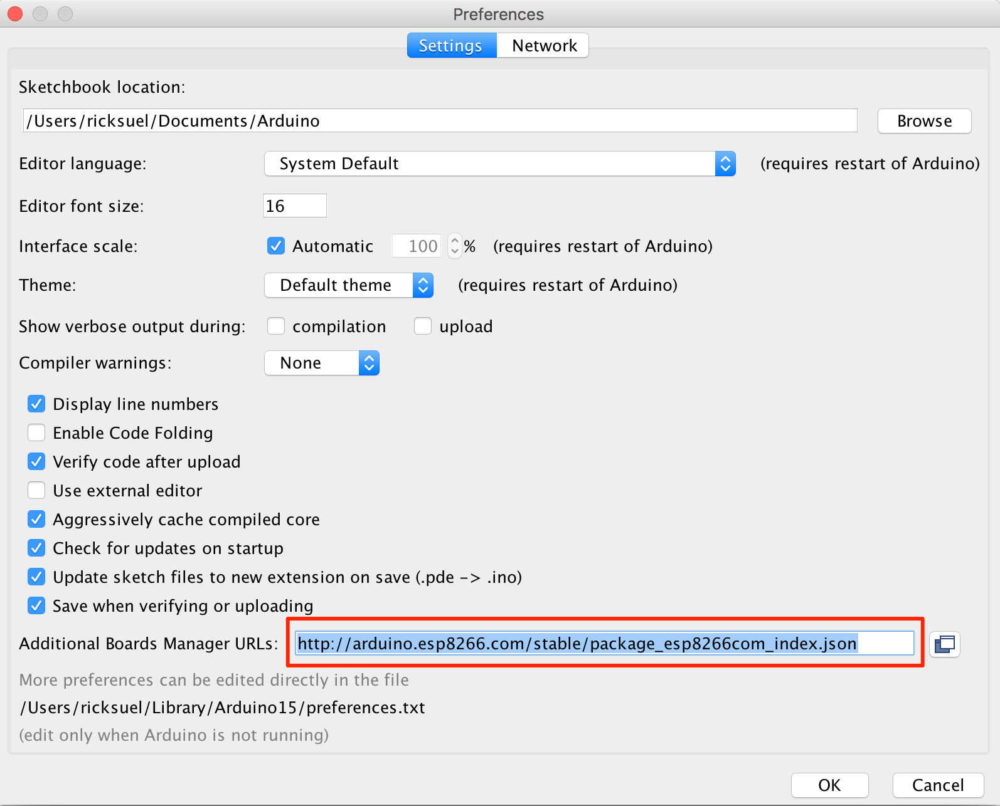
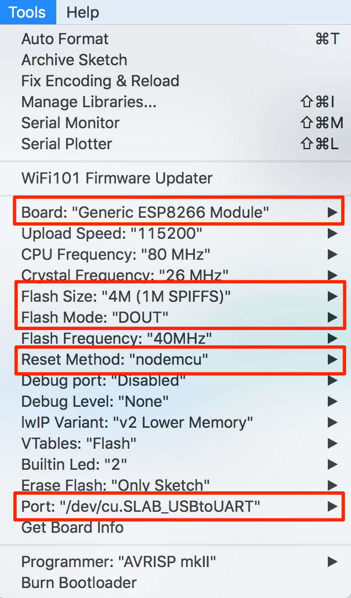

# IoT with the ESP8266
The documentation below is an outline of the class, and provides code snippets that can easily be coppied/pasted into your code as we work through the exercises.  These are being provided to allow you to keep up with the material and hopefully get the most out of the class!

## Pre-Work
The following tasks should be completed prior to class.
1. Install Arduino IDE: [Link](https://www.arduino.cc/en/Main/Software)
2. Install VCP drivers for CP2102 USB to serial chip: [Link](https://www.silabs.com/products/development-tools/software/usb-to-uart-bridge-vcp-drivers)
3. Create an account on Adafruit IO: [Link](https://io.adafruit.com/)
4. Create an account on IFTTT: [Link](https://ifttt.com/)

## Setup
### Board Manager URL
We need to tell the Arduino software where to search for board support packages so we can add support for the ESP8266. Launch the Arduino software, open the preferences/properties window, and add the following link to the **Additional Boards Manager URLs:** field:
```
http://arduino.esp8266.com/stable/package_esp8266com_index.json
```


### Device Configuration
Plug your ESP8266 into your computer's USB port.  Then configure the device as shown here under the "Tools" menu of the Arduino IDE.



### Libraries
Install the following libraries using the Arduino Library Manager: `Sketch -> Include Library -> Manage Libraries...`
1. Search "ssd1306": Install - `ESP8266 and ESP32 Oled Driver ... by Daniel Eichhorn, Fabrice Weinberg`
2. Search "dht": Install - `HDT sensor library by Adafruit`
3. Search "adafruit unified sensor": Install - `Adafruit Unified Sensor by Adafruit`
4. Search "ntp": Install - `NTPClient by Fabrice Weinberg`
5. Search "mqtt": Install - `Adafruit MQTT Library by Adafruit`

## Exercise 1 - Blinky with a simple "scheduler"
The following code provides a basic architecture for running periodic "tasks".  In this example, the built-in ESP8266 LED toggles from a callback function (task) every 500 ms. We will build on this architecture for the future exercises.
```c
// Includes

// Variables

// Functions
void setup()
{
  // Exercise 1: Blink the on-board LED.
  pinMode(LED_BUILTIN, OUTPUT);
}

void LedTask()
{
  int state = digitalRead(LED_BUILTIN);  
  digitalWrite(LED_BUILTIN, !state);   
}

typedef struct
{
  unsigned long previousMillis;
  unsigned long elapsedMillis;
  unsigned long timeoutMillis;
  void (*callback)();
} Timer_t;

static Timer_t schedulerTable[] =
{
  {0, 0, 500, &LedTask},
  // Add tasks here.
};

void runScheduler()
{
  // Run each timer in the scheduler table, and call
  for (int i = 0; i < sizeof(schedulerTable)/sizeof(Timer_t); i++)
  {
    // Note: millis() will overflow after ~50 days.  
    unsigned long currentMillis = millis();
    Timer_t *t = &schedulerTable[i];    
    t->elapsedMillis += currentMillis - t->previousMillis;
    t->previousMillis = currentMillis;
    if (t->elapsedMillis >= t->timeoutMillis)
    {
      t->elapsedMillis = 0;
      t->callback();
    }
  }
}

void loop()
{  
  runScheduler();
}
```


## Exercise 2 - Connecting to Wifi
In this exercise, we will be connecting your ESP8266 to the `iot_class` network with the password `password`.  Once connected, we will be able to do some internet-y things in the upcoming exercises :sparkles:.
### Includes
```c
#include <ESP8266WiFi.h>
```
### Variables
```c
const char* ssid     = "SSID";
const char* password = "PASSWORD";
```
### Functions
Add the following code to your `setup()` function. It will connect to the network and print the status/IP address to the serial monitor window.
```c
  Serial.begin(115200);
  delay(10);
  Serial.println();
  Serial.println();
  Serial.print("Connecting to ");
  Serial.println(ssid);
  WiFi.mode(WIFI_STA);
  WiFi.begin(ssid, password);
  while (WiFi.status() != WL_CONNECTED)
  {
    delay(500);
    Serial.print(".");
  }
  Serial.println("");
  Serial.println("WiFi connected");
  Serial.println("IP address: ");
  Serial.println(WiFi.localIP());
```


## Exercise 3 - Display Current Time
For this exercise, we need to wire the display to the ESP8266. Once wired, we can add the code to read the time from the NTP server and write it to the display.

### Wire it up

  

ESP8266 Pin | Display Pin
----------- | -------------
GPIO5       | SDA
GPIO4       | SCK
3.3V        | VDD
GND         | GND

### Includes
```c
#include <Wire.h>
#include "SSD1306Wire.h"
#include <NTPClient.h>
#include <WiFiUdp.h>
```
### Variables
This variable creates a display object with an I2C address of 0x3C (default), SDA signal on pin GPIO5, and SCK signal on pin GPIO4.
```c
SSD1306Wire  display(0x3c, 5, 4);
```

These variables will connect to the `time.nist.gov` server and offset the time for Eastern Daylight Time (Louisville, KY).
```c
int utc = -4; // Eastern daylight time
WiFiUDP udp;
NTPClient timeClient(udp, "time.nist.gov", utc * 3600, 60000);
```
### Functions
Next we need to initialize the display and the NTP client in `setup()`.  This snippet initializes the display object we created, and will print "Hello world" to the display in 24 point Arial font.
```c
  // Exercise 3 - Setup the display
  display.init();
  display.clear();
  display.flipScreenVertically();
  display.setTextAlignment(TEXT_ALIGN_LEFT);
  display.setFont(ArialMT_Plain_24);
  display.drawString(0, 0, "Hello world");
  display.display();
  
  // Exercise 3 - Start the NTP client to read the current time from the internet.
  timeClient.begin();
  timeClient.update();
```

Create a Task that runs every 1 second (1000ms) to refresh the contents of the display.
```c
void DisplayTask()
{
  display.clear();    // Clear screen.

  // Exercise 3 - Read the current time
  timeClient.update();
  String timeOfDay = timeClient.getFormattedTime();
  Serial.println(timeOfDay);
  
  // Exercise 3 - Write the current time to the display
  display.setTextAlignment(TEXT_ALIGN_CENTER);
  display.setFont(ArialMT_Plain_24);
  display.drawString(63, 0, timeOfDay);
  
  display.display(); // Render screen.
}
```

Congratulations, you now have a desktop clock that syncs with a government time server every minute!

## Exercise 4 - Read temperature and humidity using the DHT22
Our clock would be so much better if it also displayed the current temperature and humidity. We can use the DHT22 sensor to do this! First we need to wire up the sensor, then we will add the code to read it and display the temperature and humidity.

### Wire it up
  

ESP8266 Pin | DHT22 Pin
----------- | -------------
GPIO0       | DAT
3.3V        | VCC
GND         | GND

### Includes
```c
#include <Adafruit_Sensor.h>
#include <DHT.h>
```

### Variables
The following initializes a DHT22 sensor connected to pin GPIO0.  It also creates two variables to hold the temperature and humidity values when we read them.
```c
DHT dht(0, DHT22);
float temperature;
float humidity;
```

### Functions
Initialize the sensor object in `setup()`.
```c
  // Exercise 4 - Initialize the temperature sensor.
  dht.begin();
```

Create a periodic task that runs every 2 seconds.  This code should read the temp/humidity from the sensor, and if they are valid store them to the variables defined above.  Don't forget to add this periodic task to your scheduler table with a 2000ms timeout.

```c
void SensorTask()
{
  // Read the temp/humidity.
  float temp = dht.readTemperature(true);
  float hum = dht.readHumidity();

  // Store them if they are both valid.
  if (!isnan(temp) && !isnan(hum))
  {
    temperature = temp;
    humidity = hum;
  }
}
```

Finally, update the `DisplayTask()` to write the latest temperature and humidity.
```c
  // Exercise 4 - Format the temperature and humidity and write to the display
  String tempString = String(temperature, 1);
  String humidityString = String(humidity, 1);
  String sensorString = String(tempString + "F     " + humidityString + "%");
  display.setTextAlignment(TEXT_ALIGN_CENTER);
  display.setFont(ArialMT_Plain_16);
  display.drawString(63, 31, sensorString);
```


## Exercise 5 - Connecting to the Adafruit IO cloud platform
Now we are going to create a cloud dashboard that we can log into to remotely monitor the temperature and humidity from our device.
Log into your account at https://io.adafruit.com and do the following.
1. Create a feed called `temperature`.
2. Create a feed called `humidity`.
3. Create a dashboard called `IoT Class` and add widgets for the feeds (guage for humidity, time plot for temperature).

### Includes
```c
#include "Adafruit_MQTT.h"
#include "Adafruit_MQTT_Client.h"
```

### Variables
These allow your device to access your specific Adafruit account (you created one, right?)
```c
#define AIO_SERVER      "io.adafruit.com"
#define AIO_SERVERPORT  1883
#define AIO_USERNAME    "YOUR AIO USERNAME"
#define AIO_KEY         "YOUR AIO KEY"
```

These variables tell your device how to pass temperature and humidity into your Adafruit IO account using feeds.
```c
WiFiClient client;
Adafruit_MQTT_Client mqtt(&client, AIO_SERVER, AIO_SERVERPORT, AIO_USERNAME, AIO_KEY);
Adafruit_MQTT_Publish temperatureFeed = Adafruit_MQTT_Publish(&mqtt, AIO_USERNAME "/feeds/temperature");
Adafruit_MQTT_Publish humidityFeed = Adafruit_MQTT_Publish(&mqtt, AIO_USERNAME "/feeds/humidity");
```
### Functions
This new function should be called from `Setup()`.  It connects your device to the Adafruit IO system. Any errors that it encounters will be displayed on the Arduino serial monitor.
```c
void connectToAdafruit() {

  Serial.print(F("Connecting to Adafruit IO... "));

  int8_t ret;

  while ((ret = mqtt.connect()) != 0)
  {
    switch (ret)
    {
      case 1: Serial.println(F("Wrong protocol")); break;
      case 2: Serial.println(F("ID rejected")); break;
      case 3: Serial.println(F("Server unavail")); break;
      case 4: Serial.println(F("Bad user/pass")); break;
      case 5: Serial.println(F("Not authed")); break;
      case 6: Serial.println(F("Failed to subscribe")); break;
      default: Serial.println(F("Connection failed")); break;
    }

    if (ret >= 0)
    {
      mqtt.disconnect();
    }

    Serial.println(F("Retrying connection..."));
    delay(5000);
  }

  Serial.println(F("Adafruit IO Connected!"));
}
```

Create a new task called `CloudTask()` that sends your temperature and humidity to the your Adafruit IO feeds every 5 seconds. The free Adafruit IO account has a limit of 30 messages per minute (or one every 2 seconds), so a 5 second periodic task should keep us within the limit.
```c
void CloudTask()
{
    if (! mqtt.ping(3))
    {
      Serial.println(F("Failed to reach the server"));
      if (! mqtt.connected())
      {
        connectToAdafruit();
      }
    }

    if (! temperatureFeed.publish(temperature))
    {
      Serial.println(F("Failed to publish temperature"));
    }
    else
    {
      Serial.print(temperature);
      Serial.println(F(" F published!"));
    }

    if (! humidityFeed.publish(humidity))
    {
      Serial.println(F("Failed to publish humidity"));
    }
    else
    {
      Serial.print(humidity);
      Serial.println(F("% published!"));
    }  
  }
  ```
## Exercise 6 - Use IFTTT to send a text message when humidity exceeds 98%
For this exercise, you will need to do the following.
1. Log into https://ifttt.com/
2. Create a new applet.
3. Configure `This` to use Adafruit (you'll need to provide your Adafruit login credentials).
4. Select "Monitor a feed on Adafruit IO".
5. Select Feed = humidity, Relationship = greater than, Value = 98.
6. Press "Create".
7. Configure `That` to use SMS.
8. Select "Send me an SMS" (you'll need to provide your number and validate it with a pin).
9. Accept the defaults and press "Create Action".

Now breathe some hot air on your sensor and watch the texts roll in!  You may want do come up with a way to debounce this, so you aren't spammed with texts, but you get the idea of what's possible! You probably want to go ahead and disable this applet in the meantime.

### The End.
